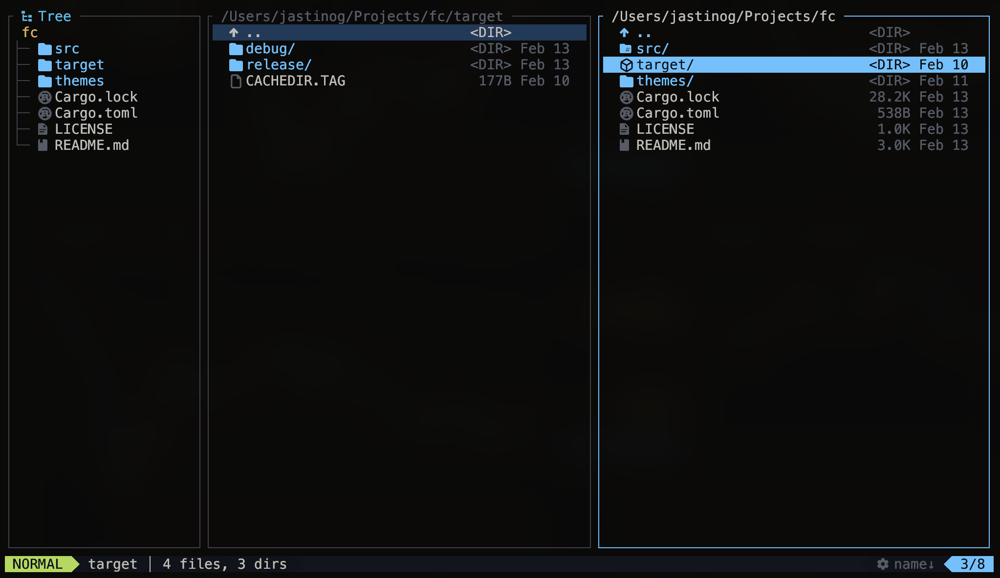
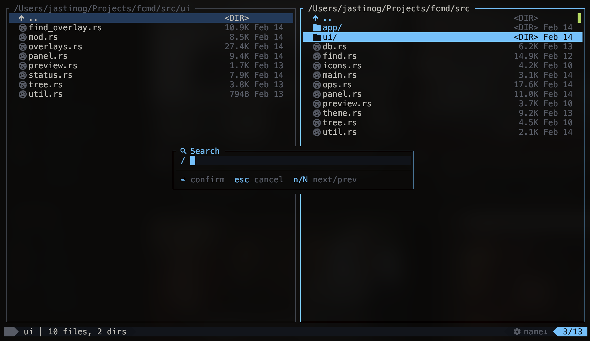
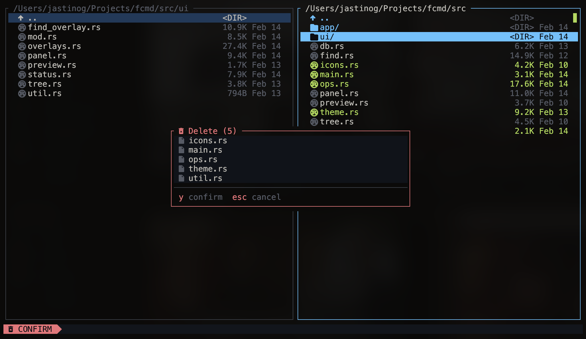
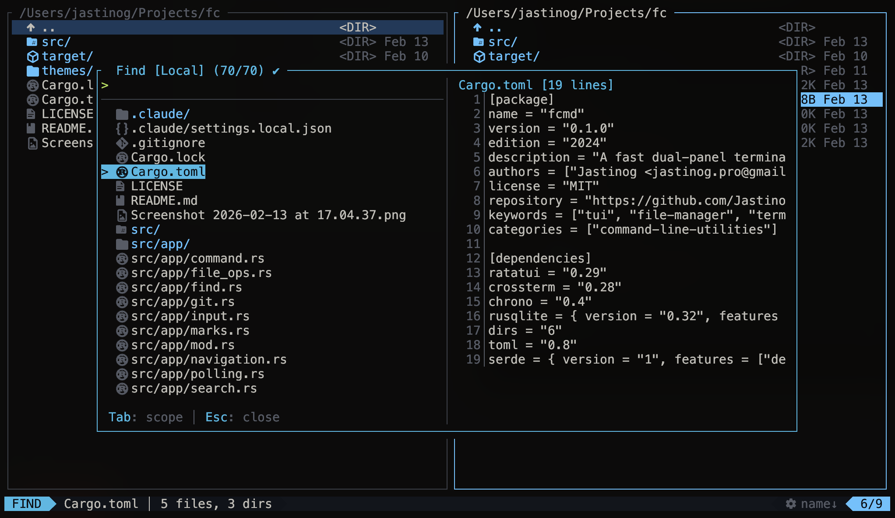
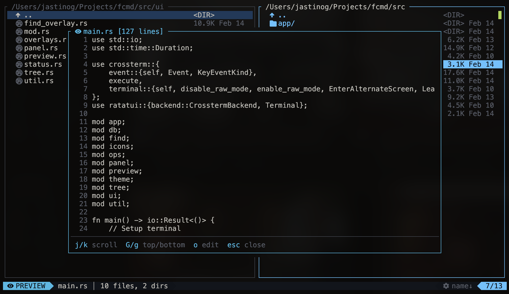
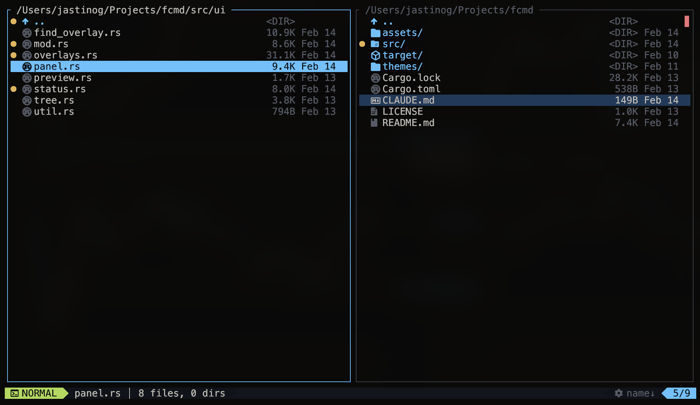
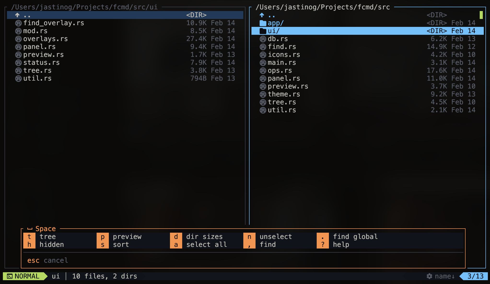

<p align="center">
  <h1 align="center">fcmd</h1>
  <p align="center">
    A fast dual-panel terminal file manager with Vim keybindings, built in Rust.
  </p>
</p>

<p align="center">
  <a href="https://github.com/Jastinog/fcmd/blob/master/LICENSE"></a>
  <a href="https://www.rust-lang.org/"></a>
  <a href="https://github.com/Jastinog/fcmd"></a>
</p>

<p align="center">
  <a href="#features">Features</a>&nbsp;&bull;
  <a href="#installation">Installation</a>&nbsp;&bull;
  <a href="#keybindings">Keybindings</a>&nbsp;&bull;
  <a href="#themes">Themes</a>&nbsp;&bull;
  <a href="#configuration">Configuration</a>&nbsp;&bull;
  <a href="LICENSE">License</a>
</p>

---



## Features

### Dual-Panel Layout

Navigate two directories side-by-side with `Tab` to switch focus. Each panel maintains independent state — path, scroll position, selection, and sort mode.

### Vim-Style Navigation

Full Vim motions: `hjkl`, `gg`/`G`, `Ctrl-d`/`Ctrl-u`, `/` incremental search with `n`/`N`. Feels natural if you live in the terminal.



### Three Selection Modes

- **Visual** (`v`) — select contiguous ranges like Vim visual mode
- **Select** (`Shift+Up/Down`) — toggle individual files
- **Glob** — `:select *.rs`, `:unselect *.log` for pattern-based selection

### File Operations with Undo

Yank (`yy`), delete (`dd`), paste (`p`/`P`), rename (`r`), create (`a`). All destructive operations are undoable (`u`) with a 50-step stack. Paste runs in the background with a progress indicator.



### Telescope-Style Fuzzy Find



`f` for local directory search, `F` for global search (macOS `mdfind`). Results appear instantly with an inline file preview.

### Tree Sidebar

`Space t` toggles a tree view on the left (20% width). Navigate with `j`/`k`, expand/collapse directories, and jump to any location.

### File Preview

`Enter` on a file opens a preview popup with syntax-aware content display. `Space p` toggles a persistent side preview panel. Scroll with `j`/`k`, open in your editor with `o`.



### Tabs

`:tabnew` creates a new tab, `gt`/`gT` switches between them. Each tab has its own pair of panels and state. Session restores all tabs on next launch.

### 28 Built-In Themes

Cycle themes with `T` or set directly with `:theme <name>`. Includes popular schemes like **catppuccin-mocha**, **tokyo-night**, **gruvbox-dark**, **rose-pine**, **dracula**, **nord**, **kanagawa**, and more. Add custom themes as TOML files.

### Git Integration



Auto-detected per-file git status indicators directly in the file list — modified, staged, untracked, and more.

### Bookmarks & Marks

`m` sets a colored visual mark (3 severity levels) on the current file. `'a`–`'z` sets named jump marks for quick navigation. All marks persist across sessions.

### Session Persistence

Tabs, paths, theme, sort modes, and visual marks are saved automatically in a local SQLite database and restored on next launch.

## Installation

### From source

```bash
git clone https://github.com/Jastinog/fcmd.git
cd fcmd
cargo build --release
```

The binary will be at `./target/release/fcmd`. Copy it to a directory in your `$PATH`:

```bash
cp target/release/fcmd ~/.local/bin/
```

### With cargo

```bash
cargo install --path .
```

### Requirements

- **Rust** (2024 edition) for building
- A [**Nerd Font**](https://www.nerdfonts.com/) for icons to render correctly
- macOS for global find (`mdfind`); local find works on all platforms

## Keybindings

### Navigation

| Key | Action |
|-----|--------|
| `j` / `k` | Move down / up |
| `h` / `l` | Go to parent / enter directory |
| `Enter` | Enter directory / preview file |
| `gg` / `G` | Jump to top / bottom |
| `Ctrl-d` / `Ctrl-u` | Half-page down / up |
| `Tab` | Switch panel |
| `~` | Go to home directory |
| `/` | Incremental search |
| `n` / `N` | Next / previous search match |

### File Operations

| Key | Action |
|-----|--------|
| `yy` | Yank (copy to register) |
| `dd` | Delete (with confirmation) |
| `p` | Paste into active panel |
| `P` | Paste (overwrite existing) |
| `r` | Rename in-place |
| `a` | Create new file or directory |
| `u` | Undo last operation |
| `yp` | Copy file path to clipboard |
| `o` | Open in `$VISUAL` / `$EDITOR` |

### Selection

| Key | Action |
|-----|--------|
| `v` | Visual mode (contiguous range) |
| `Shift+Up/Down` | Select mode (toggle individual) |
| `Space a` | Select all |
| `Space n` | Unselect all |
| `:select <glob>` | Select by glob pattern |
| `:unselect <glob>` | Unselect by glob pattern |

### Preview Popup

| Key | Action |
|-----|--------|
| `Enter` | Open preview on a file |
| `j` / `k` | Scroll down / up |
| `G` / `g` | Jump to bottom / top |
| `Ctrl-d` / `Ctrl-u` | Half-page down / up |
| `o` | Open in editor |
| `Esc` / `q` | Close preview |

### Find

| Key | Action |
|-----|--------|
| `f` | Find in current directory |
| `F` | Find globally (macOS `mdfind`) |
| `Space ,` | Find local (alternative) |
| `Space .` | Find global (alternative) |

### Space Leader

Press `Space` to open a which-key style popup with all available commands:



| Key | Action |
|-----|--------|
| `Space t` | Toggle tree sidebar |
| `Space h` | Toggle hidden files |
| `Space p` | Toggle side preview |
| `Space d` | Calculate directory sizes |
| `Space s` | Sort popup |
| `Space ?` | Show help |
| `Space a` | Select all |
| `Space n` | Unselect all |

### Command Mode

| Command | Action |
|---------|--------|
| `:cd <path>` | Change directory |
| `:mkdir <name>` | Create directory |
| `:touch <name>` | Create file |
| `:rename <name>` | Rename selected item |
| `:theme <name>` | Set color theme |
| `:sort <mode>` | Set sort (name/size/modified/created/ext) |
| `:select <glob>` | Select files matching pattern |
| `:unselect <glob>` | Unselect files matching pattern |
| `:du` | Calculate directory sizes |
| `:tabnew` | Open new tab |
| `:tabclose` | Close current tab |
| `:q` | Quit |

### Sort Shortcuts

| Key | Mode |
|-----|------|
| `sn` | Sort by name |
| `ss` | Sort by size |
| `sd` | Sort by date modified |
| `sc` | Sort by date created |
| `se` | Sort by extension |

## Themes

28 built-in themes:

| | | | |
|---|---|---|---|
| ayu-dark | catppuccin-latte | catppuccin-mocha | dracula |
| everforest-dark | github-dark | gruvbox-dark | gruvbox-light |
| horizon | kanagawa | modus-vivendi | monokai-pro |
| moonfly | moonlight | nightfox | nord |
| one-dark | oxocarbon | palenight | poimandres |
| rose-pine | solarized-dark | sonokai | spaceduck |
| synthwave84 | tokyo-night | vesper | zenburn |

### Custom Themes

Drop a TOML file into `~/.config/fcmd/themes/` and it will be auto-discovered. Use any built-in theme as a template.

## Configuration

fcmd stores its data in `~/.config/fcmd/`:

| Path | Description |
|------|-------------|
| `~/.config/fcmd/fcmd.db` | SQLite database (session, marks, cache) |
| `~/.config/fcmd/themes/` | Custom theme files (TOML) |

The editor for `o` is determined by `$VISUAL`, then `$EDITOR`, defaulting to `vim`.

## License

[MIT](LICENSE) &copy; Jastinog
