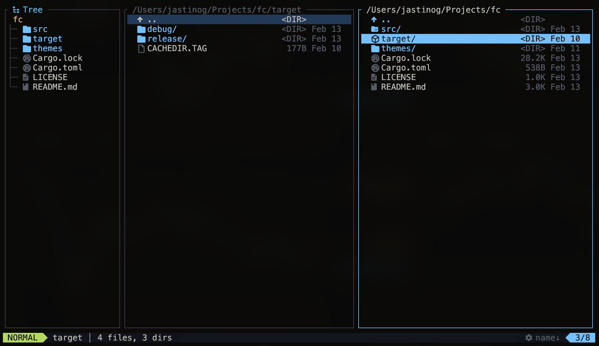
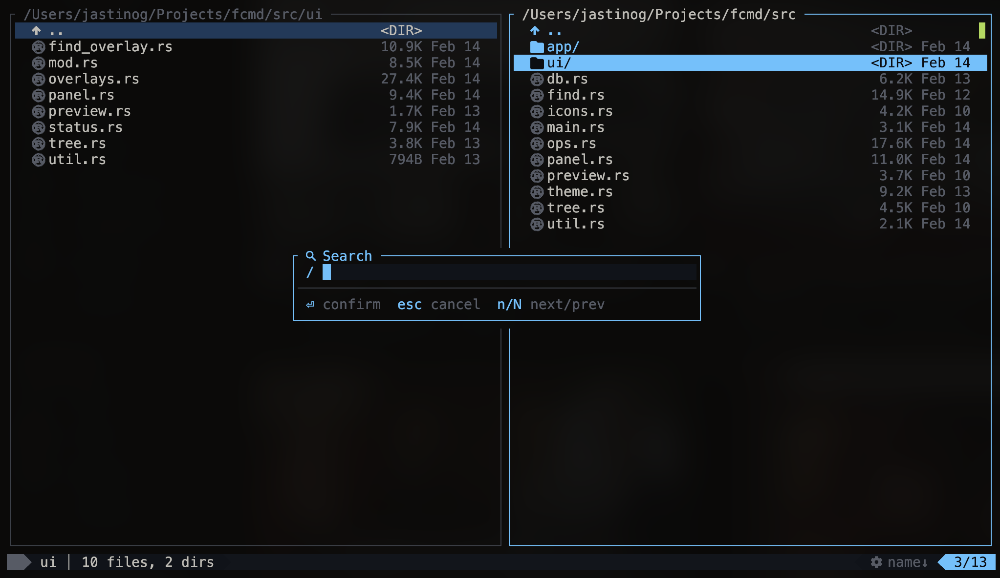
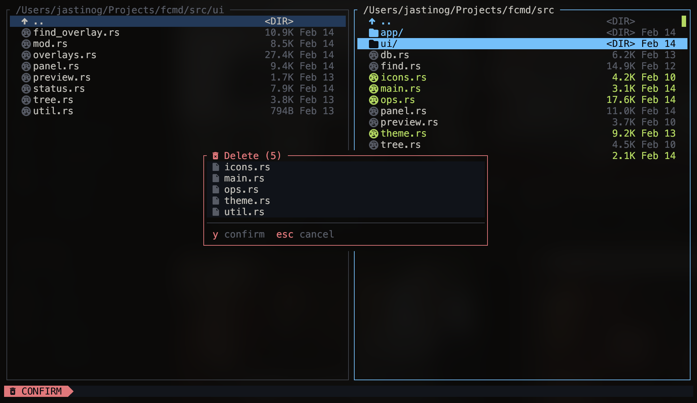
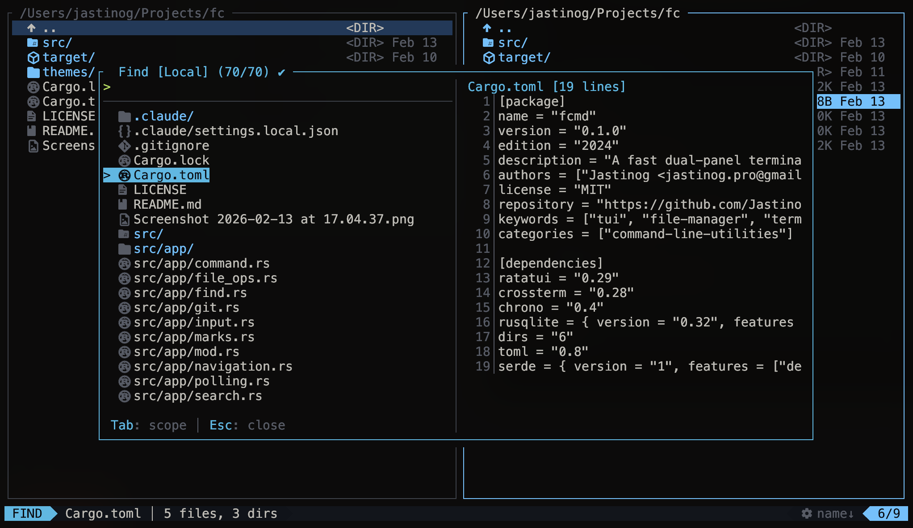
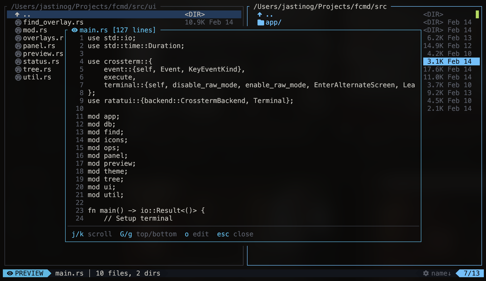
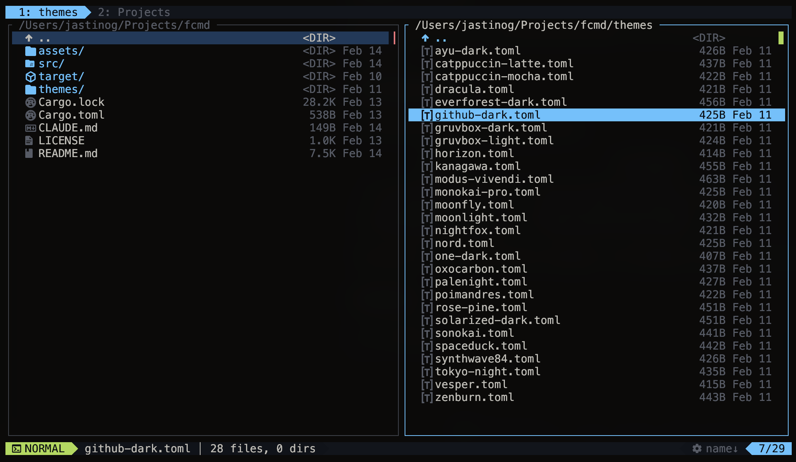
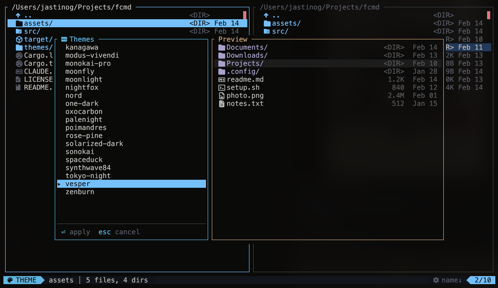
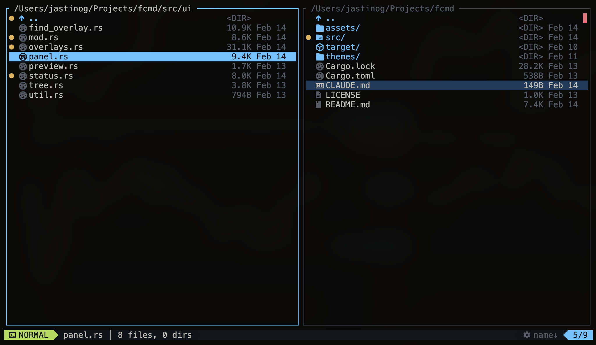
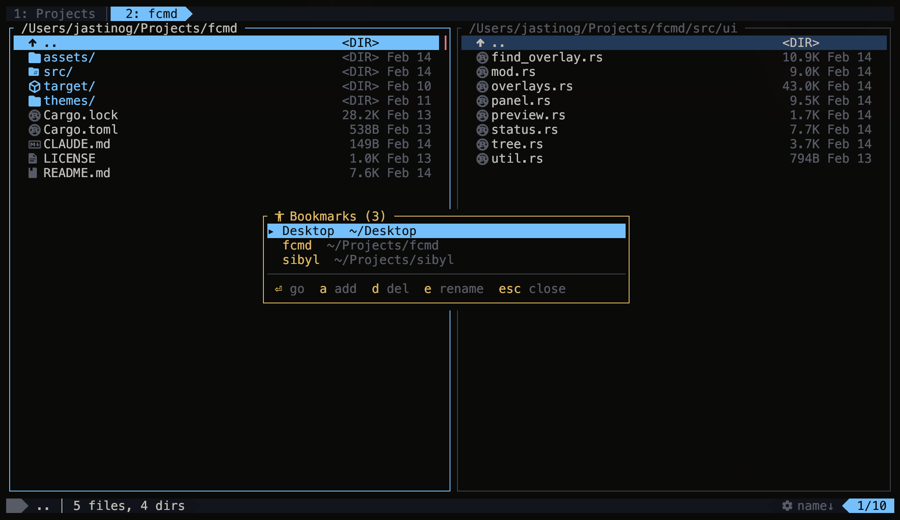
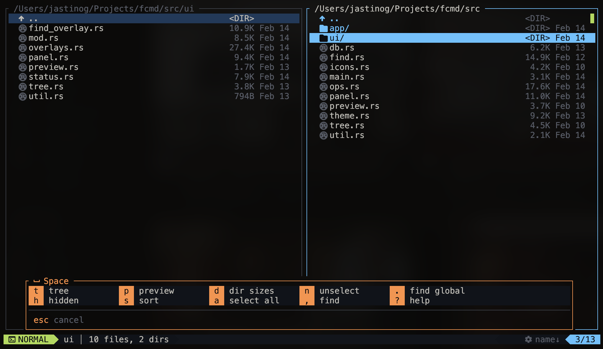

<p align="center">
  <h1 align="center">fcmd</h1>
  <p align="center">
    A fast dual-panel terminal file manager with Vim keybindings, built in Rust.
  </p>
</p>

<p align="center">
  <a href="https://github.com/Jastinog/fcmd/blob/master/LICENSE"></a>
  <a href="https://www.rust-lang.org/"></a>
  <a href="https://github.com/Jastinog/fcmd"></a>
</p>

<p align="center">
  <a href="#features">Features</a>&nbsp;&bull;
  <a href="#installation">Installation</a>&nbsp;&bull;
  <a href="#keybindings">Keybindings</a>&nbsp;&bull;
  <a href="#themes">Themes</a>&nbsp;&bull;
  <a href="#configuration">Configuration</a>&nbsp;&bull;
  <a href="LICENSE">License</a>
</p>

---



## Features

### Dual-Panel Layout

Navigate two directories side-by-side with `Tab` to switch focus. Each panel maintains independent state — path, scroll position, selection, and sort mode. Swap the panels with `Space w s`, or equalize them (`=` / `Space w e`) to point the other panel(s) at the active directory.

### Symlinks

Create links without leaving the manager: `:ln <target> [name]` makes a symlink (name defaults to the target's basename), `:hardlink <target> [name]` makes a hard link — both undoable with `u`.

### Vim-Style Navigation

Full Vim motions: `hjkl`, `gg`/`G`, `Ctrl-d`/`Ctrl-u`, `/` incremental search with `n`/`N`. Feels natural if you live in the terminal.



### Three Selection Modes

- **Visual** (`v`) — select contiguous ranges like Vim visual mode
- **Select** (`Shift+Up/Down`) — toggle individual files
- **Glob** — `:select *.rs`, `:unselect *.log` for pattern-based selection

### File Operations with Undo

Yank (`yy`), delete (`dd` to trash / `dD` permanently), paste (`p`/`P`), rename (`r`), create (`a`). All destructive operations are undoable (`u`) with a 50-step stack. Paste runs in the background with a progress indicator.



### Bulk Rename

Select multiple files and press `cw` to open an interactive bulk rename overlay. Edit each name inline with `i`, navigate between files with `j`/`k`, and use `:%s/old/new` to find & replace across all names at once. Conflicts (duplicates, empty names) are highlighted in red. Works from Normal, Visual, and Select modes. Also available via `:bulkrename`.

### File Info

Press `i` on any file or directory to see detailed information: type, full path, size, permissions (rwx with color coding), owner/group, timestamps (modified, created, accessed), inode, hard links, device, and git status. For directories, total size, file count, and subdirectory count are calculated in the background.

### Permissions & Ownership

`cp` opens an interactive chmod dialog with live octal-to-rwx preview. `co` opens a chown picker with scrollable user/group columns to change ownership.

### Telescope-Style Fuzzy Find



`f` for local directory search, `F` for global search. Global search uses `mdfind` (Spotlight) on macOS, [`fd`](https://github.com/sharkdp/fd) when it's on your `PATH` (any OS, including Windows), and falls back to `find` on Unix. Results appear instantly with an inline file preview.

### Content Search (grep)

`:grep <pattern>` searches inside files under the current directory and lists every matching line in the same telescope overlay. Each result shows `path:line` plus the matched text, and the side preview jumps straight to the matching line. Press `Enter` to open the file in the viewer at that line. Uses [`ripgrep`](https://github.com/BurntSushi/ripgrep) (`rg`) when available, falling back to `grep`. Type in the overlay to live-refine the search.

### Live Filter

`Space f` narrows the current listing in place as you type — non-matching entries disappear, so the panel shows only what you care about (`..` always stays for navigation). Unlike `/` search, which just moves the cursor, the filter restricts what's visible, and operations like select-all or yank act on the visible subset. `Enter` keeps the filter (shown in the panel title), `Esc` reverts it, and the filter clears automatically when you change directory.

### Tree Sidebar

`Space t` toggles a tree view on the left (20% width). Navigate with `j`/`k`, expand/collapse directories, and jump to any location.

### File Viewer

`Enter` (or `F3`) on a file opens a full-screen viewer with syntax highlighting for source code. Toggle soft-wrap with `w`, line numbers with `#`, and a hex view of any file with `x`. Binary files open as hex dumps automatically. Scroll with `j`/`k` (`Ctrl-d`/`u`/`f`/`b` for pages), jump with `g`/`G`, scroll horizontally with `h`/`l` when wrap is off, search with `/` (smart-case) and navigate matches with `n`/`N`, open in your editor with `o`, close with `q`. `Space p` toggles a persistent side preview panel.



### Tabs



`Ctrl+T` creates a new tab, `Ctrl+W` closes it, `gt`/`gT` switches between them. Each tab has its own pair of panels and state. The tab bar is always visible at the top. Session restores all tabs on next launch.

### 217 Built-In Themes (Dark & Light)



Browse themes with `T` or set directly with `:theme <name>`. The theme picker automatically classifies themes into Dark and Light categories based on background luminance. Includes popular schemes like **catppuccin-mocha**, **tokyo-night**, **gruvbox-dark**, **rose-pine**, **dracula**, **nord**, **kanagawa**, and many more — plus light variants like **catppuccin-latte**, **github-light**, **solarized-light**, **rose-pine-dawn**, and others. Add custom themes as TOML files.

### Git Integration



Auto-detected per-file git status indicators directly in the file list — modified, staged, untracked, and more.

Work the tree without leaving the manager: `gs` stages the file under the cursor (or the whole selection) with `git add`, `gu` unstages it (`git restore --staged`), and `gd` opens its diff in the full-screen viewer with syntax highlighting. Status icons refresh automatically after staging.

### Bookmarks & Marks



`b` bookmarks the selected directory, `B` opens the bookmarks popup — navigate, add (`a`), delete (`d`), rename (`e`). `m` sets a colored visual mark (3 severity levels) on the current file, `M` jumps to the next marked file. `'a`–`'z` sets named jump marks for quick navigation. All marks and bookmarks persist across sessions.

### Session Persistence

Tabs, paths, cursor positions, theme, sort modes, directory sizes, and visual marks are saved automatically in a local SQLite database and restored on next launch.

### Mouse Support

Keyboard-first, but the mouse works too. Click a file to move the cursor (and focus its panel), double-click a directory to enter it or a file to open the viewer, and scroll the wheel to move through the panel under the pointer. Click a tab in the tab bar to switch to it, and use the wheel to scroll the file viewer.

---

## Installation

### From source

```bash
git clone https://github.com/Jastinog/fcmd.git
cd fcmd
cargo build --release
```

The binary will be at `./target/release/fcmd`. Copy it to a directory in your `$PATH`:

```bash
cp target/release/fcmd ~/.local/bin/
```

### With cargo

```bash
cargo install --path .
```

### Requirements

- **Rust** (2024 edition) for building
- A [**Nerd Font**](https://www.nerdfonts.com/) for icons to render correctly
- Global find uses `mdfind` on macOS, [`fd`](https://github.com/sharkdp/fd) elsewhere (install it for Windows/Linux global search), or `find` on Unix; local find works on all platforms
- Content search (`:grep`) prefers [`ripgrep`](https://github.com/BurntSushi/ripgrep) (`rg`), falling back to `grep`
- Clipboard (`yp`/`yn`) uses `pbcopy` (macOS), `clip` (Windows), or `wl-copy`/`xclip` (Linux)

---

## Keybindings

### Navigation

| Key | Action |
|-----|--------|
| `j` / `k` | Move down / up |
| `h` / `l` | Go to parent / enter directory |
| `Enter` | Enter directory / view file |
| `gg` / `G` | Jump to top / bottom |
| `Ctrl-d` / `Ctrl-u` | Half-page down / up |
| `Tab` | Switch panel |
| `Ctrl-l` / `Ctrl-h` | Focus right / left panel |
| `=` | Equalize (point other panels at current dir) |
| `Space w s` / `Space w e` | Swap / equalize panels |
| `gt` / `gT` | Next / previous tab |
| `Ctrl+T` | New tab |
| `Ctrl+W` | Close tab |
| `~` | Go to home directory |
| `-` | Go to parent (alternative) |

### Search

| Key | Action |
|-----|--------|
| `/` | Incremental search |
| `n` / `N` | Next / previous search match |
| `Space f` | Live filter (narrow listing) |

### File Operations

| Key | Action |
|-----|--------|
| `yy` | Yank (copy to register) |
| `dd` | Move to trash (with confirmation) |
| `dD` | Permanently delete (with confirmation) |
| `p` | Paste into active panel |
| `P` | Paste (overwrite existing) |
| `r` | Rename in-place |
| `cw` | Bulk rename selected files |
| `a` | Create new file or directory (append `/` for dir) |
| `u` | Undo last operation |
| `yp` | Copy file path to clipboard |
| `yn` | Copy file name to clipboard |
| `o` | Open in `$VISUAL` / `$EDITOR` |
| `i` | File / directory info popup |
| `cp` | Permissions (chmod) |
| `co` | Owner (chown) |

### Git

| Key | Action |
|-----|--------|
| `gs` | Stage file(s) (`git add`) |
| `gu` | Unstage file(s) (`git restore --staged`) |
| `gd` | View diff in the viewer |

### Selection

| Key | Action |
|-----|--------|
| `v` / `V` | Visual mode (contiguous range) |
| `Shift+Up/Down` | Select mode (toggle individual) |
| `Space a` | Select all |
| `Space n` | Unselect all |
| `:select <glob>` | Select by glob pattern |
| `:unselect <glob>` | Unselect by glob pattern |

### Visual Marks

| Key | Action |
|-----|--------|
| `m` | Toggle visual mark (cycles 3 severity levels) |
| `M` | Jump to next visual mark |

### Find

| Key | Action |
|-----|--------|
| `f` | Find in current directory |
| `F` | Find globally (macOS `mdfind`) |
| `Space ,` | Find local (alternative) |
| `Space .` | Find global (alternative) |

### File Viewer

| Key | Action |
|-----|--------|
| `Enter` / `F3` | Open the viewer on a file |
| `j` / `k` | Scroll down / up |
| `G` / `g` | Jump to bottom / top |
| `Ctrl-d` / `Ctrl-u` | Half-page down / up |
| `Ctrl-f` / `Ctrl-b` | Full page down / up |
| `w` | Toggle soft-wrap |
| `#` | Toggle line numbers |
| `x` / `Tab` | Toggle hex view |
| `h` / `l` / `0` | Scroll left / right / line start (wrap off) |
| `/` | Search within file (smart-case) |
| `n` / `N` | Next / previous match |
| `o` | Open in editor |
| `Esc` / `q` | Close viewer |

### Info Popup

| Key | Action |
|-----|--------|
| `i` | Open info popup |
| `j` / `k` | Scroll down / up |
| `Ctrl-d` / `Ctrl-u` | Half-page down / up |
| `Esc` / `q` / `i` | Close |

### Sort

| Key | Mode |
|-----|------|
| `sn` | Sort by name |
| `ss` | Sort by size |
| `sd` / `sm` | Sort by date modified |
| `sc` | Sort by date created |
| `se` | Sort by extension |
| `sr` | Reverse sort order |
| `Space s` | Sort popup (interactive) |

### Space Leader Menu

Press `Space` to open a which-key style popup with all available commands:



| Key | Action |
|-----|--------|
| `Space t` | Toggle tree sidebar |
| `Space h` | Toggle hidden files |
| `Space p` | Toggle side preview |
| `Space d` | Calculate directory sizes |
| `Space s` | Sort popup |
| `Space b` | Open bookmarks |
| `Space ?` | Show help |
| `Space a` | Select all |
| `Space n` | Unselect all |
| `Space ,` | Find local |
| `Space .` | Find global |

### Bookmarks

| Key | Action |
|-----|--------|
| `b` | Bookmark current directory |
| `B` | Open bookmarks popup |

Inside the bookmarks popup: `Enter` to go, `a` to add, `d` to delete, `e` to rename.

### Named Marks

| Key | Action |
|-----|--------|
| `'a`–`'z` | Go to named mark |

Set marks via `:mark <a-z>` in command mode.

### Other

| Key | Action |
|-----|--------|
| `T` | Theme picker |
| `J` / `K` | Scroll side preview |
| `Ctrl-r` | Refresh current panel |
| `q` | Quit |

### Command Mode

Press `:` to enter command mode.

| Command | Action |
|---------|--------|
| `:q` / `:quit` | Quit |
| `:cd <path>` | Change directory |
| `:mkdir <name>` | Create directory |
| `:touch <name>` | Create file |
| `:rename <name>` | Rename selected item |
| `:bulkrename` | Bulk rename selected files |
| `:find <query>` | Find in current directory |
| `:grep <pattern>` | Search file contents (ripgrep/grep) |
| `:ln <target> [name]` | Create a symlink (name defaults to target basename) |
| `:hardlink <target> [name]` | Create a hard link |
| `:swap` | Swap the two panels |
| `:equalize` / `:sync` | Point other panels at the active panel's directory |
| `:theme <name>` | Set color theme |
| `:sort <mode>` | Set sort (name/size/mod/cre/ext) |
| `:select <glob>` | Select files matching pattern |
| `:unselect <glob>` | Unselect files matching pattern |
| `:hidden` | Toggle hidden files |
| `:du` | Calculate directory sizes |
| `:bookmark <name>` | Bookmark current directory |
| `:bookmarks` | Open bookmarks popup |
| `:brename <old> <new>` | Rename a bookmark |
| `:bdel <name>` | Delete a bookmark |
| `:mark <a-z>` | Set a named mark |
| `:marks` | List all named marks |
| `:tabnew` | Open new tab |
| `:tabclose` | Close current tab |
| `:tabnext` / `:tabprev` | Navigate tabs |

---

## Themes

217 built-in themes (168 dark + 49 light). Browse with `T` or set with `:theme <name>`.

<details>
<summary><strong>Dark themes (168)</strong></summary>

| | | | |
|---|---|---|---|
| abyss | afterglow | amber | andromeda |
| apprentice | arctic | ashes | atom-one-dark |
| aura-dark | aurora | ayu-dark | ayu-mirage |
| badwolf | bamboo | base16-default-dark | base16-ocean |
| black-atom | blood-moon | blueprint | bluloco-dark |
| boo-berry | brogrammer | carbonfox | catppuccin-frappe |
| catppuccin-macchiato | catppuccin-mocha | challenger-deep | cherry |
| citruszest | cobalt2 | codedark | cosmos |
| cyberdream | darcula | dark-fox | dark-meadow |
| dark-pastel | dark-plus | dark-violet | darkburn |
| decay | deep-ocean | deep-space | doom-one |
| doom-vibrant | dracula | dracula-pro | duskfox |
| earthsong | edge-dark | eldritch | embark |
| espresso | everblush | everforest-dark | fairy-floss |
| falcon | far-classic | fleet-dark | forest |
| frozen | github-dark | github-dark-default | github-dark-high-contrast |
| github-dark-tritanopia | github-dimmed | gotham | gruvbox-dark |
| gruvbox-hard | gruvbox-material | hacker | halcyon |
| hardhacker | horizon | horizon-dark | hybrid |
| hyper | iceberg | inferno | jellybeans |
| kanagawa | kanagawa-dragon | kanagawa-wave | lackluster |
| lavender | materia | material-darker | material-ocean |
| material-palenight | mc-classic | melange | mellow |
| miasma | midnight | midnight-blue | min-dark |
| modus-vivendi | molokai | monochrome | monokai |
| monokai-pro | moonbow | moonfly | moonlight |
| nebula | neon | night-city | night-owl |
| nightfly | nightfox | noctis | noir |
| nord | nordic | nova | obsidian |
| oceanic-next | omni | one-dark | one-monokai |
| onedark-vivid | oxocarbon | palefire | palenight |
| panda | papercolor-dark | paradise | penumbra-dark |
| phosphor | pine | poimandres | radical |
| retrowave | rose-pine | rose-pine-moon | seti |
| shades-of-purple | slate | snazzy | solarized-dark |
| solarized-osaka | sonokai | spaceduck | spacemacs-dark |
| srcery | submarine | sunset | sweetie |
| synthwave84 | tender | terafox | thunderstorm |
| tokyo-night | tokyonight-moon | tokyonight-storm | tomorrow-night |
| tomorrow-night-bright | umbra | vesper | vitesse-dark |
| vividchalk | vscode-dark | wilmersdorf | witch-hazel |
| wombat | xcode-dusk | zenbones | zenburn |

</details>

<details>
<summary><strong>Light themes (49)</strong></summary>

| | | | |
|---|---|---|---|
| acme | alabaster | ayu-light | base16-default-light |
| bluloco-light | catppuccin-latte | cosmic-latte | dawnfox |
| dayfox | edge-light | everforest-light | flatwhite |
| fleet-light | flexoki-light | github-light | github-light-default |
| github-light-high-contrast | gruvbox-light | horizon-light | intellij-light |
| kanagawa-lotus | leuven | lucius-light | material-light |
| melange-light | min-light | modus-operandi | night-owl-light |
| noctis-lux | nord-light | one-light | oxocarbon-light |
| papercolor-light | pencil-light | quiet-light | rose-pine-dawn |
| sakura | serendipity-light | soft-era | solarized-light |
| spacemacs-light | summerfruit-light | tokyo-night-day | tomorrow |
| vitesse-light | vs-light | winter-is-coming-light | xcode-light |
| zenbones-light | | | |

</details>

### Custom Themes

Drop a TOML file into `~/.config/fcmd/themes/` and it will be auto-discovered. Use any built-in theme as a template.

---

## Configuration

fcmd stores its data in `~/.config/fcmd/`:

| Path | Description |
|------|-------------|
| `~/.config/fcmd/fcmd.db` | SQLite database (session, marks, bookmarks, sorts, sizes) |
| `~/.config/fcmd/themes/` | Custom theme files (TOML) |

The editor for `o` is determined by `$VISUAL`, then `$EDITOR`, defaulting to `vi`.

---

## License

[MIT](LICENSE) &copy; Jastinog
